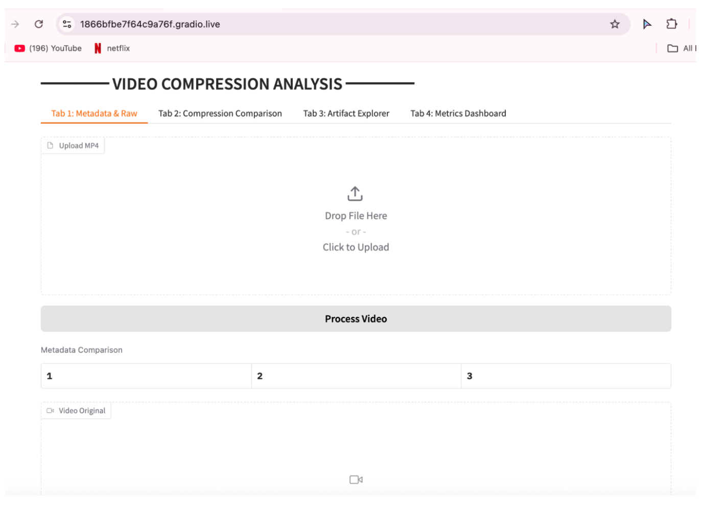
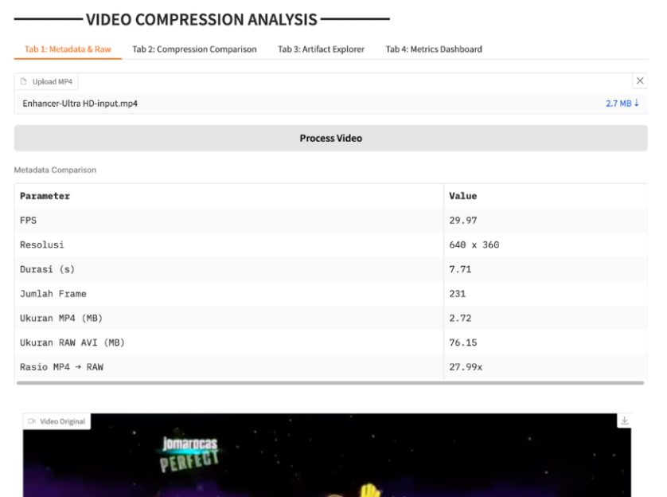
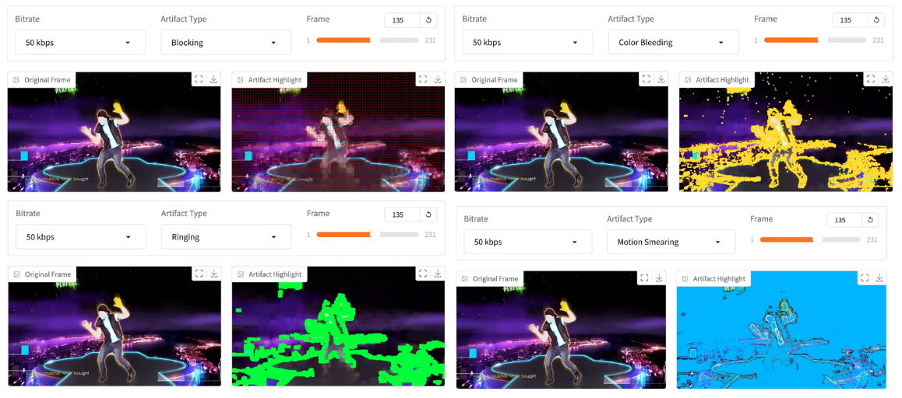
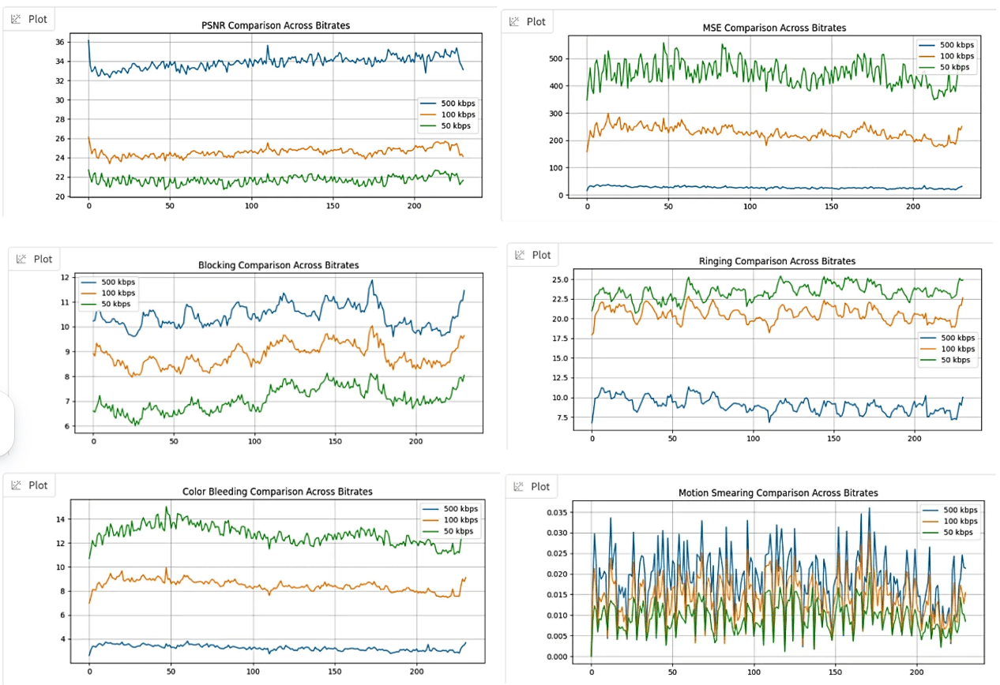

# 🎥 Video Compression Artifact Analysis

An interactive video quality analysis tool developed to evaluate compression artifacts at different bitrate levels. This project combines video processing, metadata extraction, objective quality metrics, and visual artifact inspection through a user-friendly Gradio interface.

---

## 📌 Project Overview

Video compression reduces storage and transmission requirements but often introduces visual distortions known as compression artifacts. This project analyzes the impact of bitrate reduction on video quality by comparing compressed videos using objective metrics and visual inspection techniques.

The system enables users to:

- Upload and analyze compressed videos.
- Compare visual artifacts across different bitrate settings.
- Extract video metadata automatically.
- Evaluate objective quality metrics.
- Visualize bitrate-quality relationships through interactive graphs.

---

## 🎯 Objectives

- Analyze the effect of bitrate reduction on video quality.
- Identify common compression artifacts.
- Compare objective quality metrics between videos.
- Provide an easy-to-use visualization platform using Gradio.

---

## 🛠 Technical Toolkit

| Category | Tools & Technologies |
|----------|---------------------|
| Programming | Python, Jupyter Notebook |
| Video Processing | OpenCV, FFmpeg |
| Data Analysis | NumPy, Pandas |
| Visualization | Matplotlib |
| Interface | Gradio |
| Platform | Google Colab |

---

## 📷 Project Highlights

### 🖥 Gradio User Interface



Interactive web interface allowing users to:

- Upload videos
- Analyze artifacts
- View metadata
- Compare bitrate performance
- Visualize quality metrics

---
### 📊 Metadata Analysis



Automatic extraction of video properties including:

- Resolution
- Bitrate
- Frame rate
- Codec information
- File size

---
### ⚖️ Bitrate Comparison


Comparison of multiple bitrate settings to analyze the trade-off between compression efficiency and visual quality.

---

### 🎞 Video Artifact Analysis



Visual comparison of compressed video frames to identify compression artifacts such as:

- Blocking artifacts
- Ringing effects
- Color Bleeding
- Motion Smearing

---
### 📈 Quality Metrics Visualization



Visualization of objective quality metrics to evaluate compression performance across different bitrate levels.

---

## 📚 Documentation

Project documents can be accessed directly below:

📄 [Final Report](docs/final_report.pdf)

📑 [Project Presentation](docs/project_presentation.pdf)

📘 [User Manual](docs/user_manual.pdf)

---

## 🚀 Running the Project

1. Open `notebook/video_compression_artifact_analysis.ipynb` in Google Colab.

2. Run all cells to install required libraries:
```bash
pip install gradio opencv-python ffmpeg-python
```

3. Execute the notebook until Gradio generates a public URL.

4. Open the generated URL in your browser.

5. Upload videos and start analyzing compression artifacts, metadata, and quality metrics.

---

## 📖 Key Learning Outcomes

- Video compression fundamentals
- Compression artifact analysis
- Video metadata extraction
- Objective video quality assessment
- Interactive dashboard development using Gradio
- Data visualization for multimedia systems

---

## 👩‍💻 Author

**Anindya Putri Defana**

Electrical Engineering Student — Universitas Indonesia
